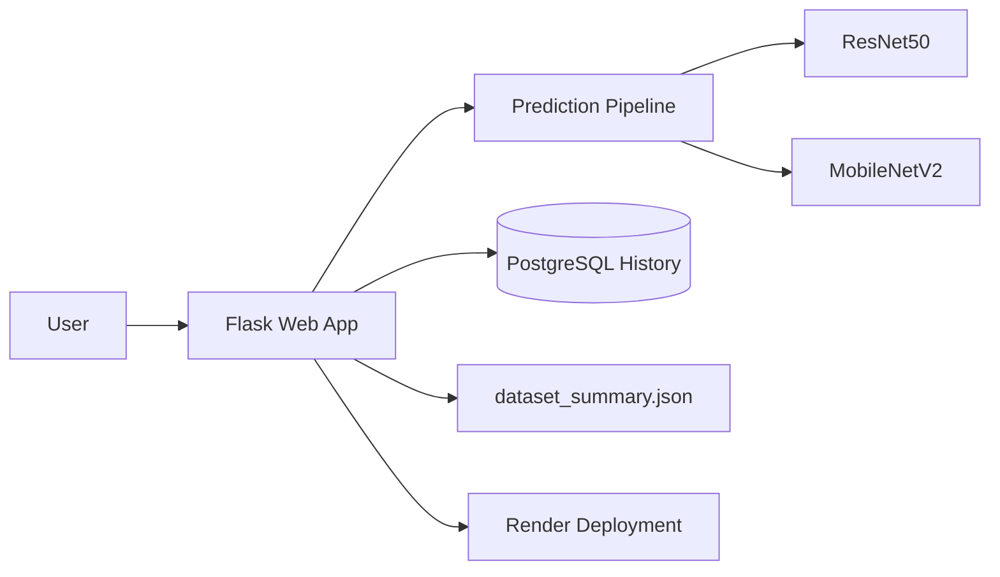

# PlantInsight

[](https://www.python.org/)
[](https://flask.palletsprojects.com/)
[](https://www.tensorflow.org/)
[](https://render.com/)
[](https://git-lfs.com/)

PlantInsight is a Flask web app for citrus leaf disease classification. It compares two CNN models, ResNet50 and MobileNetV2, and shows prediction results, history, and a compact dataset summary on the About page.

## Features

- Upload a citrus leaf image and get predictions from both models
- Compare confidence scores and display the best model
- Save prediction history in the database
- Show a dataset distribution chart from a generated summary file
- Deployable on Render with PostgreSQL

## Tech Stack

- Python 3
- Flask
- TensorFlow / Keras
- Flask-SQLAlchemy
- PostgreSQL on Render
- Gunicorn for production

## Architecture



The app flow is simple:

1. The user uploads a citrus leaf image.
2. Flask saves the file and sends it through both TensorFlow models.
3. The app compares the confidence scores and renders the result page.
4. Prediction history is stored in PostgreSQL on Render.
5. The About page reads a small generated dataset summary instead of scanning the full dataset folder.

## Local Setup

1. Create and activate a virtual environment.
2. Install dependencies:

```bash
pip install -r requirements.txt
```

3. Run the app:

```bash
python run.py
```

4. Open the app in your browser at `http://127.0.0.1:5000`.

## Render Deployment

This repository includes a `render.yaml` blueprint. Render uses:

- `gunicorn run:app --bind 0.0.0.0:$PORT`
- a PostgreSQL database created from the blueprint

## Vercel Deployment

Vercel can run the Flask app through `api/index.py` and `vercel.json`, but this project is not a great fit for production on Vercel because the TensorFlow models are large and the function cold start can be slow.

If you still want to test it on Vercel:

- deploy the repo as a Python project
- make sure `DATABASE_URL` points to an external PostgreSQL database
- expect `/tmp/uploads` to be temporary on each deployment
- keep the model files in Git LFS, but be aware that Vercel may still struggle with their size
- Vercel defaults to demo mode (`PLANTINSIGHT_DEMO_MODE=1`), so the site can load without importing TensorFlow on startup
- turn demo mode off only if you explicitly want real model inference and accept the heavier cold start

## Project Structure

- `app/` - Flask app, routes, templates, services, and model loading logic
- `models/` - trained model files and saved metrics
- `dataset/` - local training dataset used to generate the summary file
- `render.yaml` - Render blueprint for web service and database
- `vercel.json` - Vercel routing config for the Flask entrypoint
- `requirements.txt` - Python dependencies

## Notes

- The model files are stored with Git LFS.
- The About page reads from `app/data/dataset_summary.json` instead of scanning the full dataset folder at runtime.
- If you clone this repo, make sure Git LFS is installed before pulling the model files.
